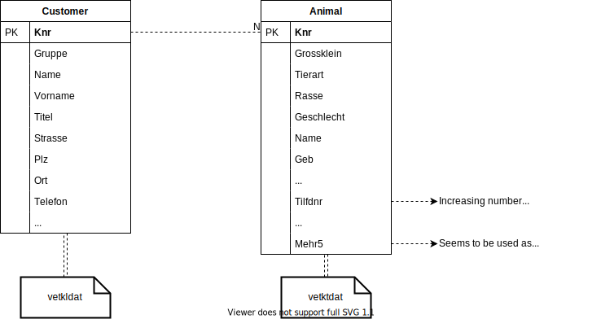

# go-vetinf

A Go package to read data from [VetInf](https://vetinf.de).

:warning: This project is not associated with the VetInf software or VetInf GmbH. :warning:

This repository is based on a personal reverse engeneering effort that targets extraction of specific information. Contributions for a more general approach are welcome.

## Project Scope and Motivation

Unfortunately the VetInf software does not provide any user-facing API which would allow integration into information systems deployed in a veterinary clinic. Although one can integrate lots of different devices and other systems (like DICOM imager or third-party analyzers) into VetInf, accessing data like customer or animal records stored by VetInf is not easily possible. This project is an on-going effort to extract specific information from a VetInf installation which I need for integration. The library is only ever tested against the VetInf version deployed at our veterinary clinic and no guarantees or warranties in what ever form are provided. See [LICENSE](./LICENSE) for more information.

## Overview

VetInf uses DBase (III?) files for storing various data including customer and animal related data as well as billing information and medical records of treated animals. Filenames typlically look like `vetkldat.dbf`, `vetktdat.dbf` or `vetgddat.dbf` and are stored in the `Infdat` directory (assuming no database server is used). Along those `.dbf` files there is also a set of `.i1` and `.ebu` files. It looks like `.i1` files are used as an index file to quickly find the DBase record index in the associated `.dbf` file.

.

